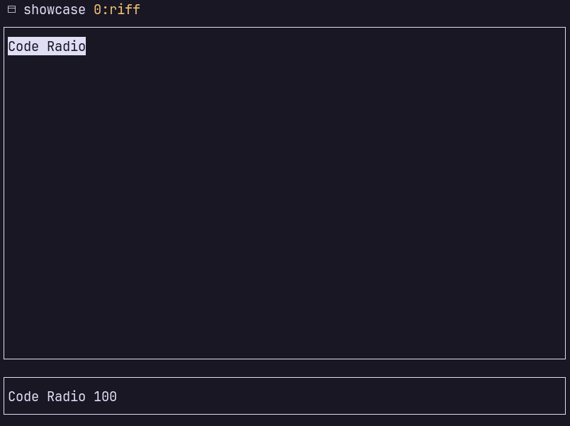

# Riff
Minimal and lightweight terminal radio player



# Controls
| Key           | Description   |
| ------------- | ------------- |
| q             | quit          |
| j             | scroll down   |
| k             | scroll up     |
| n             | volume down   |
| p             | volume up     |
| space         | toggle volume |
| enter         | play station  |
| escape        | stop station  |

# Config
Default directory for config files:

- Linux: ```~/.config/riff/```

If the directory doesn't exist it creates one and generates default config files:

- ```mpv.conf``` - used for mpv configuration

```
stream-lavf-o-append=timeout=10000000
stream-lavf-o-append=reconnect_on_http_error=4xx,5xx
stream-lavf-o-append=reconnect_delay_max=30
stream-lavf-o-append=reconnect_streamed=yes
stream-lavf-o-append=reconnect_on_network_error=yes
```

- ```riff.json``` - used for specifying the stations

```json
[
    {
        "name": "Code Radio",
        "url": "https://coderadio-admin-v2.freecodecamp.org/listen/coderadio/radio.mp3"
    }
]
```

# Build
```fish
make
make run
```

## Dependencies
- ncurses
- mpv
- jansson

```
sudo dnf install ncurses-devel mpv-devel jansson-devel
```
